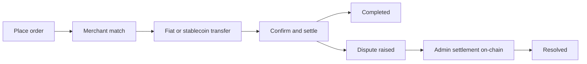

## 3.1 Actors

The protocol involves several key participants working together to enable trustless peer-to-peer transactions.

**Buyers and Sellers** are everyday users who initiate on-ramp or off-ramp orders. They interact with the protocol through client applications using integrated wallets and transact without surrendering custody of their funds.

**Merchants**, also known as liquidity peers, serve as the counterparties who mediate liquidity between stablecoins and fiat currencies. These are carefully vetted participants who maintain sufficient liquidity and have established strong reputations through the Proof-of-Credibility system.

**Protocol Contracts** are the on-chain smart contracts that orchestrate the entire order lifecycle. They handle order queuing, matching based on credibility scores, state verification, and final settlement outcomes. These contracts currently operate on Base L2, with Solana support planned.

**Proof Verifiers** currently validate ZK-KYC proofs for identity verification, including government IDs, social accounts, and passports via Reclaim Protocol and other ZK verifiers. Bank transaction verification is planned (-> [Section 4.1](/whitepaper/cryptographic-primitives-proof-integration#42-evidence-module-for-bank-transaction-verification-roadmap)).

**Governance** encompasses the mechanisms through which protocol parameters, upgrades, and treasury decisions are made. The current implementation is admin/multisig operated, with a planned transition to broader token-holder governance as the protocol matures.

## 3.2 Components

**Base L2 smart contracts** (Solana planned) handle order lifecycle, matching, dispute windows, parameter registry, and fee routing.

**Reputation registry** implements Proof-of-Credibility with inputs, scoring, and decay mechanisms.

**Oracle adapter** provides reference pricing and safeguards including median/TWAP, fallbacks, and circuit breakers.

**Client SDKs** and reference applications such as [Coins.me](https://coins.me) interface with the protocol directly.

## 3.3 High-Level Flow

1. **Placing Orders:** A user initiates a "Buy USDC" or "Sell USDC" request and enters the desired amount. The app provides an integrated wallet for the transaction.
2. **Order Matching:** A list of carefully vetted merchants is queued via Proof-of-Credibility. A fiat payment address is shared over the smart contract, encrypted with the user's keys. For off-ramps, a USDC address on Base (Solana planned) is presented.
3. **Fiat/Stablecoin Transfer:** The payer performs the transfer on the designated payment rail.
4. **Confirmation/Settlement:** Within minutes, settlement succeeds once the merchant confirms receipt. Wallet balances update accordingly.
5. **Dispute Window:** If a party contests, they submit evidence that a payment or action occurred (or did not). In the live implementation, authorized admins settle disputed orders on-chain according to protocol fault rules and dispute windows.



## 3.4 On-Ramp Flow

```
┌─────────────────────────────────────────────────────────────────────────┐
│                       ON-RAMP FLOW (Fiat → USDC)                        │
├─────────────────────────────────────────────────────────────────────────┤
│                                                                         │
│   ┌──────────┐          ┌──────────────┐          ┌──────────────┐      │
│   │   USER   │          │   PROTOCOL   │          │   MERCHANT   │      │
│   └────┬─────┘          └──────┬───────┘          └──────┬───────┘      │
│        │                       │                          │             │
│        │  1. Open BUY order    │                          │             │
│        │  (amount + rail)      │                          │             │
│        │──────────────────────►│                          │             │
│        │                       │                          │             │
│        │                       │  2. Match via PoC        │             │
│        │                       │  (credibility score)     │             │
│        │                       │─────────────────────────►│             │
│        │                       │                          │             │
│        │  3. Receive fiat      │                          │             │
│        │  payment address      │                          │             │
│        │◄──────────────────────│                          │             │
│        │  (encrypted)          │                          │             │
│        │                       │                          │             │
│        │  4. Transfer fiat via bank/UPI/PIX               │             │
│        │─────────────────────────────────────────────────►│             │
│        │                       │                          │             │
│        │                       │  5. Merchant confirms    │             │
│        │                       │  receipt                 │             │
│        │                       │◄─────────────────────────│             │
│        │                       │                          │             │
│        │  6. USDC released     │                          │             │
│        │  to user wallet       │                          │             │
│        │◄──────────────────────│                          │             │
│        │                       │                          │             │
│   ┌────▼─────┐          ┌──────▼───────┐          ┌──────▼───────┐      │
│   │   USDC   │          │     FEES     │          │    BONDS     │      │
│   │ RECEIVED │          │  COLLECTED   │          │   UNLOCKED   │      │
│   └──────────┘          └──────────────┘          └──────────────┘      │
│                                                                         │
└─────────────────────────────────────────────────────────────────────────┘
```

## 3.5 Off-Ramp Flow

```
┌─────────────────────────────────────────────────────────────────────────┐
│                       OFF-RAMP FLOW (USDC → Fiat)                       │
├─────────────────────────────────────────────────────────────────────────┤
│                                                                         │
│   ┌──────────┐          ┌──────────────┐          ┌──────────────┐      │
│   │   USER   │          │   PROTOCOL   │          │   MERCHANT   │      │
│   └────┬─────┘          └──────┬───────┘          └──────┬───────┘      │
│        │                       │                          │             │
│        │  1. Open SELL order   │                          │             │
│        │  + lock USDC          │                          │             │
│        │──────────────────────►│                          │             │
│        │                       │                          │             │
│        │                       │  2. Match via PoC        │             │
│        │                       │  + merchant posts bond   │             │
│        │                       │─────────────────────────►│             │
│        │                       │                          │             │
│        │  3. Share fiat        │                          │             │
│        │  receiving address    │                          │             │
│        │──────────────────────►│                          │             │
│        │  (encrypted)          │                          │             │
│        │                       │                          │             │
│        │  Fiat received        │  4. Merchant sends       │             │
│        │◄──────────────────────────────────────────────── │             │
│        │                       │  fiat payment            │             │
│        │                       │                          │             │
│        │                       │  5. Merchant submits     │             │
│        │                       │  payment confirmation    │             │
│        │                       │◄─────────────────────────│             │
│        │                       │                          │             │
│        │                       │  6. USDC released        │             │
│        │                       │  to merchant             │             │
│        │                       │─────────────────────────►│             │
│        │                       │                          │             │
│   ┌────▼─────┐          ┌──────▼───────┐          ┌──────▼───────┐      │
│   │   FIAT   │          │     FEES     │          │     USDC     │      │
│   │ RECEIVED │          │  COLLECTED   │          │   RECEIVED   │      │
│   └──────────┘          └──────────────┘          └──────────────┘      │
│                                                                         │
└─────────────────────────────────────────────────────────────────────────┘
```

## 3.6 Key Considerations

The **merchant** serves the function of mediating liquidity for transactions.

The **onus of confirming payment** rests on the merchant for off-ramps, though either party may provide confirmation in applicable scenarios.

**ZK-KYC performs trustless identity verification** for the user without exposing personal data.

**Evidence is submitted and reviewed** in disputes. In the current system, outcomes are executed via on-chain admin settlement; broader verifier and governance-driven resolution remains on the roadmap (-> [Section 4.2](/whitepaper/cryptographic-primitives-proof-integration#42-evidence-module-for-bank-transaction-verification-roadmap)).

**Reclaim Protocol** enables privacy-preserving identity verification via social accounts and government IDs.