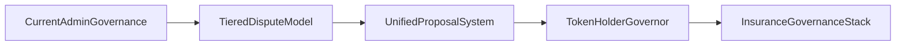

The following items remain part of the intended governance direction. They should be treated as roadmap design rather than current behavior.

## A) Multi-Tier Dispute Governance

- T1 resolver stage, T2 jury stage, and T3 token-governance stage.
- SLA-based auto-escalation and explicit appeal windows across tiers.

## B) Unified Proposal System

- A single proposal primitive covering disputes, claims, audits, and parameter changes.
- Standardized proposal states and execution windows.

## C) Insurance Governance Stack

- CAIP/CALR/PIP pool hierarchy with programmable slash/reward logic and dispute-linked payouts.

## D) Token-Holder Native Governor

- Full protocol decision-making by `$P2P` token governance with differentiated quorum/rules by proposal class.

---