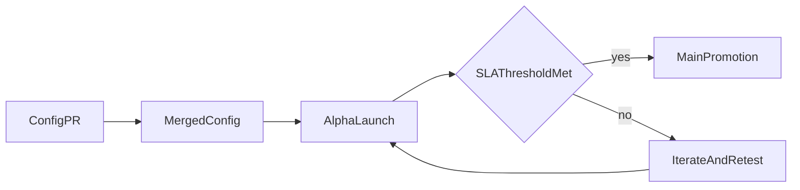

## The idea

Adding a new country today requires manual coordination with no standard process. Local knowledge is siloed. This includes which rails are free, which QR formats work, and what settlement times look like. The expansion framework solves this by making country configs open-source and promotion criteria transparent.

## Core proposal

- Open-source country YAML configs capturing local payment-rail knowledge
- Alpha environment where new currencies launch with explicit "no SLA guaranteed" framing
- Public health metrics (settlement rate, dispute rate, volume) that gate promotion to the main app

## Main building blocks

- Country-level config schema (currency, channels, limits, fees, feeds)
- App-side config consumption
- Contract-side configuration execution
- Alpha/Main lifecycle operations
- Public dashboard metrics for settlement/dispute/volume health

## Why it matters

The bottleneck for geographic expansion is local knowledge. Open-source configs let anyone with local expertise propose a new currency. Public SLA gates ensure quality without requiring HQ to manually evaluate every market. The result is a scalable expansion model where community contribution directly increases protocol reach.

---