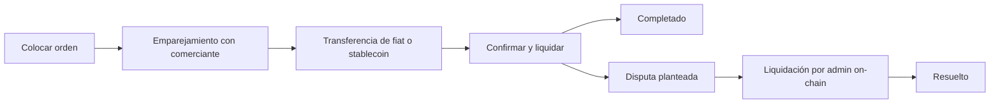

## 3.1 Actores

El protocolo involucra a varios participantes clave que trabajan juntos para habilitar transacciones peer-to-peer sin confianza.

**Compradores y Vendedores** son usuarios cotidianos que inician órdenes de on-ramp u off-ramp. Interactúan con el protocolo a través de aplicaciones cliente utilizando wallets integradas y transaccionando sin ceder la custodia de sus fondos.

**Comerciantes**, también conocidos como pares de liquidez, actúan como contrapartes que median la liquidez entre stablecoins y monedas fiat. Estos son participantes cuidadosamente vetados que mantienen liquidez suficiente y han establecido fuertes reputaciones a través del sistema Proof-of-Credibility.

**Contratos del Protocolo** son los smart contracts on-chain que orquestan todo el ciclo de vida de las órdenes. Manejan el encolamiento de órdenes, el emparejamiento basado en puntajes de credibilidad, la verificación de estado y los resultados finales de liquidación. Estos contratos operan actualmente en Base L2 (con expansión multichain a Solana planeada).

**Verificadores de Pruebas** validan actualmente las pruebas ZK-KYC para la verificación de identidad (IDs gubernamentales, cuentas sociales y pasaportes a través de Reclaim Protocol y otros verificadores ZK). La verificación de transacciones bancarias está planificada (ver [Sección 4.2](/es/whitepaper/cryptographic-primitives-proof-integration#42-módulo-de-evidencia-para-verificación-de-transacciones-bancarias-hoja-de-ruta)).

**Gobernanza** abarca los mecanismos a través de los cuales se toman decisiones sobre parámetros del protocolo, actualizaciones y la tesorería. La implementación actual es operada por admin/multisig, con una transición planificada hacia una gobernanza más amplia por parte de los poseedores del token a medida que el protocolo madure.

## 3.2 Componentes

- **Smart contracts de Base L2** (en expansión a Solana) para el ciclo de vida de las órdenes, emparejamiento, ventanas de disputa, registro de parámetros y enrutamiento de comisiones.
- **Registro de reputación** que implementa Proof-of-Credibility (entradas, puntuación, decaimiento).
- **Adaptador de oráculos** para precios de referencia y salvaguardas (mediana/TWAP, fallbacks, circuit breakers).
- **SDKs de cliente** y aplicaciones de referencia (ej. Coins.me) que se comunican con el protocolo.

## 3.3 Flujo de Alto Nivel

1. **Colocación de Órdenes:** Un usuario hace clic en “Comprar USDC” (o “Vender USDC”) e ingresa el monto. La app proporciona una wallet integrada para la transacción.
2. **Emparejamiento de Órdenes:** Se asigna un comerciante on-chain basado en USDC stakeado. Se comparte una dirección de pago fiat a través del smart contract, cifrada con las claves del usuario; para off-ramps, se presenta una dirección de USDC en Base (en expansión a Solana).
3. **Transferencia Fiat/Stablecoin:** El pagador realiza la transferencia en la vía designada.
4. **Confirmación/Liquidación:** En minutos, la liquidación se completa una vez que el comerciante confirma la recepción. Los saldos de las wallets se actualizan en consecuencia.
5. **Ventana de Disputa:** Si alguna parte impugna, presenta evidencia de que un pago o acción ocurrió (o no ocurrió). En la implementación actual, administradores autorizados resuelven las órdenes en disputa on-chain según las reglas de falla del protocolo y las ventanas de disputa.



## 3.4 Flujo del On-Ramp

```
┌─────────────────────────────────────────────────────────────────────────┐
│                     FLUJO ON-RAMP (Fiat → USDC)                         │
├─────────────────────────────────────────────────────────────────────────┤
│                                                                         │
│   ┌──────────┐         ┌──────────────┐         ┌──────────────┐        │
│   │ USUARIO  │         │  PROTOCOLO   │         │ COMERCIANTE  │        │
│   └────┬─────┘         └──────┬───────┘         └──────┬───────┘        │
│        │                      │                        │                │
│        │ 1. Abre orden de     │                        │                │
│        │ BUY (compra)         │                        │                │
│        │ (monto + vía)        │                        │                │
│        │─────────────────────►│                        │                │
│        │                      │                        │                │
│        │                      │  2. Emparejamiento     │                │
│        │                      │  vía PoC               │                │
│        │                      │  (puntaje de           │                │
│        │                      │  credibilidad)         │                │
│        │                      │───────────────────────►│                │
│        │                      │                        │                │
│        │  3. Recibe dirección │                        │                │
│        │  de pago fiat        │                        │                │
│        │◄─────────────────────│                        │                │
│        │  (encriptado)        │                        │                │
│        │                      │                        │                │
│        │  4. Transfiere fiat  │                        │                │
│        │  vía banco/UPI/PIX   │                        │                │
│        │──────────────────────────────────────────────►│                │
│        │                      │                        │                │
│        │                      │  5. Comerciante        │                │
│        │                      │  confirma la recepción │                │
│        │                      │◄───────────────────────│                │
│        │                      │                        │                │
│        │  6. USDC liberado    │                        │                │
│        │  a la wallet del     │                        │                │
│        │  usuario             │                        │                │
│        │◄─────────────────────│                        │                │
│        │                      │                        │                │
│   ┌────▼─────┐         ┌──────▼───────┐         ┌──────▼───────┐        │
│   │   USDC   │         │  COMISIONES  │         │    BONOS     │        │
│   │ RECIBIDO │         │   COBRADAS   │         │ DESBLOQUEADOS│        │
│   └──────────┘         └──────────────┘         └──────────────┘        │
│                                                                         │
└─────────────────────────────────────────────────────────────────────────┘
```

## 3.5 Flujo del Off-Ramp

```
┌─────────────────────────────────────────────────────────────────────────┐
│                    FLUJO OFF-RAMP (USDC → Fiat)                         │
├─────────────────────────────────────────────────────────────────────────┤
│                                                                         │
│   ┌──────────┐         ┌──────────────┐         ┌──────────────┐        │
│   │ USUARIO  │         │  PROTOCOLO   │         │ COMERCIANTE  │        │
│   └────┬─────┘         └──────┬───────┘         └──────┬───────┘        │
│        │                      │                        │                │
│        │ 1. Abre orden de     │                        │                │
│        │ SELL (venta)         │                        │                │
│        │  + bloquea USDC      │                        │                │
│        │─────────────────────►│                        │                │
│        │                      │                        │                │
│        │                      │  2. Emparejamiento     │                │
│        │                      │  vía PoC               │                │
│        │                      │  + comerciante publica │                │
│        │                      │    garantía            │                │
│        │                      │───────────────────────►│                │
│        │                      │                        │                │
│        │  3. Comparte         │                        │                │
│        │  dirección para      │                        │                │
│        │  recibir fiat        │                        │                │
│        │─────────────────────►│                        │                │
│        │  (encriptado)        │                        │                │
│        │                      │                        │                │
│        │                      │  4. Comerciante envía  │                │
│        │  Recibe fiat         │  pago fiat             │                │
│        │◄──────────────────────────────────────────────│                │
│        │                      │                        │                │
│        │                      │  5. Comerciante sube   │                │
│        │                      │  confirmación de pago  │                │
│        │                      │◄───────────────────────│                │
│        │                      │                        │                │
│        │                      │  6. USDC liberado      │                │
│        │                      │  al comerciante        │                │
│        │                      │───────────────────────►│                │
│        │                      │                        │                │
│   ┌────▼─────┐         ┌──────▼───────┐         ┌──────▼───────┐        │
│   │   FIAT   │         │  COMISIONES  │         │     USDC     │        │
│   │ RECIBIDO │         │   COBRADAS   │         │   RECIBIDO   │        │
│   └──────────┘         └──────────────┘         └──────────────┘        │
│                                                                         │
└─────────────────────────────────────────────────────────────────────────┘
```

## 3.6 Consideraciones clave

- El **comerciante** cumple la función de mediar la liquidez para las transacciones.
- La **responsabilidad de confirmar el pago** recae en el comerciante (para off-ramps) o puede ser proporcionada por cualquiera de las partes.
- **ZK-KYC realiza verificación de identidad sin confianza** para el usuario sin exponer datos personales.
- **La evidencia se envía y revisa** en las disputas. En el sistema actual, los resultados se ejecutan mediante liquidación por admin on-chain; la resolución más amplia impulsada por verificadores y gobernanza permanece en la hoja de ruta (ver [Sección 4.2](/es/whitepaper/cryptographic-primitives-proof-integration#42-módulo-de-evidencia-para-verificación-de-transacciones-bancarias-hoja-de-ruta)).
- **Reclaim Protocol** habilita la verificación de identidad que preserva la privacidad mediante cuentas sociales e IDs gubernamentales.

---

